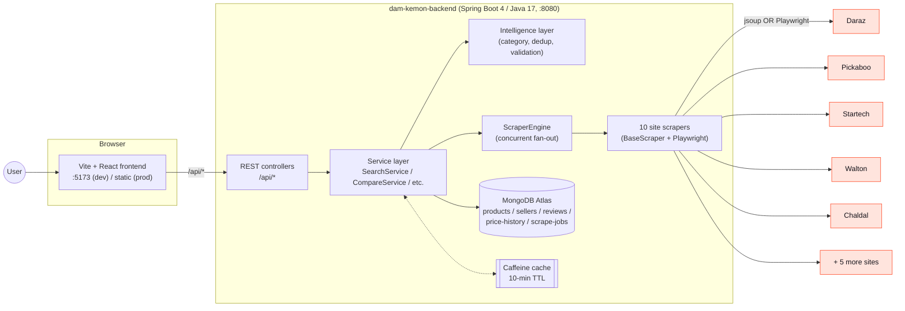
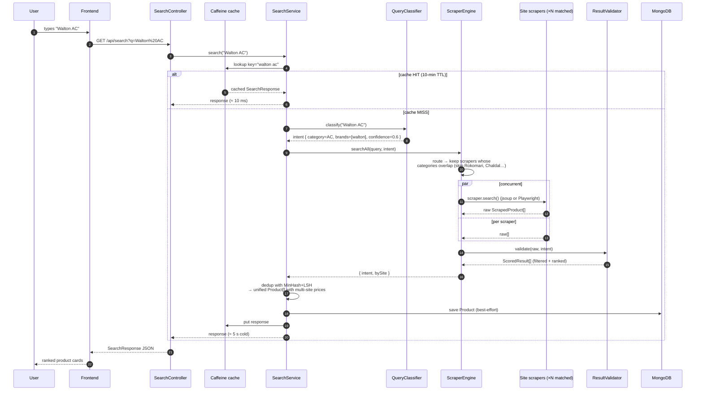
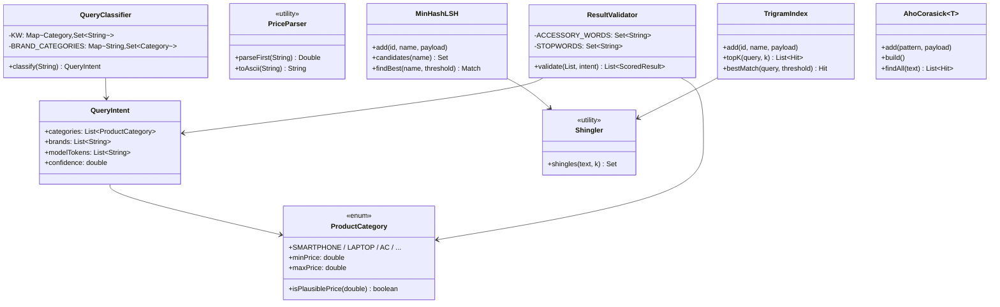
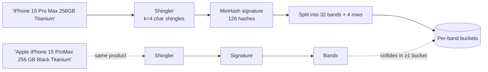
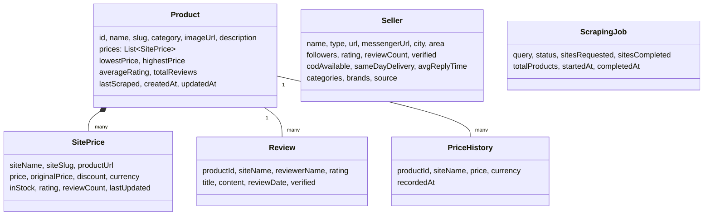
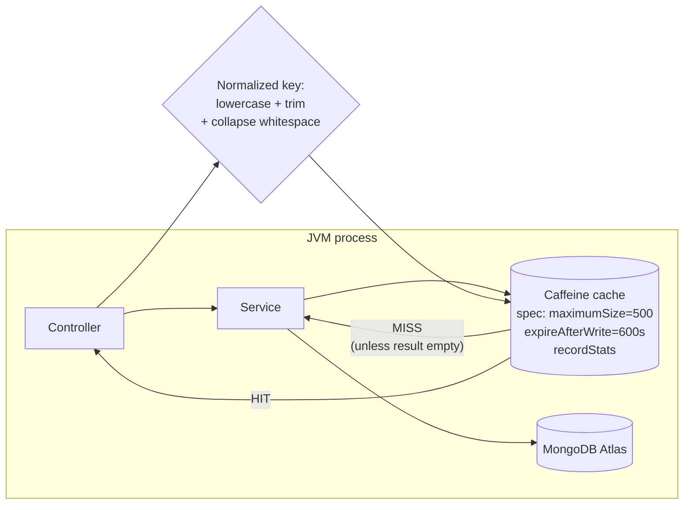

# Damkemon — Architecture

> Bangladesh price comparison engine. Search any product → we check 50+ ecom
> sites and Facebook sellers and surface the cheapest. The repo has two
> services: a Spring Boot backend (`dam-kemon-backend/`) and a Vite + React
> frontend (`frontend/`).

---

## 1. System map



---

## 2. The search request — end-to-end sequence



---

## 3. ScraperEngine — the heart

### 3a. Components

```mermaid
flowchart TB
    subgraph Engine["ScraperEngine"]
        ROUTE[Route by intent.categories]
        POOL[Fixed thread-pool<br/>size = max(4, #scrapers)]
        FANOUT[Fan-out<br/>CompletableFuture.allOf]
        TIMEOUT[Per-scraper timeout<br/>5 s]
    end

    subgraph Scrapers["Each scraper"]
        IFACE["EcommerceScraper interface<br/>• getSupportedCategories()<br/>• handlesGeneralQueries()<br/>• search(query)"]
        BASE["BaseScraper (abstract)<br/>• retry + UA rotation<br/>• per-host throttle<br/>• jsoup fetch()"]
        BROWSER["BrowserFetcher (singleton)<br/>• Playwright + Chromium<br/>• used by Daraz, Walton"]
        IMPL10["10 implementations<br/>Daraz · Pickaboo · Startech · Ryans<br/>BD-Shop · Othoba · Priyoshop · Walton<br/>Chaldal · Rokomari"]
        BASE --> IFACE
        BROWSER -.-> IMPL10
        IMPL10 --> BASE
    end

    Engine --> Scrapers
```

### 3b. Routing decision (which scrapers to call)

This is the change that fixed "Walton AC was returning Rokomari (a books site) at ৳0.101":

```mermaid
flowchart TB
    Q[User query] --> CLS[QueryClassifier]
    CLS --> INTENT{Intent<br/>category + brands +<br/>model tokens + confidence}
    INTENT -- "confidence ≥ 0.2" --> CHECK{For each scraper:<br/>does its categories<br/>overlap intent's?}
    INTENT -- "confidence < 0.2<br/>(unknown)" --> GENERALISTS[Use generalist<br/>scrapers only<br/>(Daraz, Pickaboo, BD-Shop, Othoba, Priyoshop)]
    CHECK -- yes --> ROUTE[Add to routed set]
    CHECK -- "no & generalist" --> CHECK_PRIMARY{Generalist also<br/>supports primary<br/>category?}
    CHECK_PRIMARY -- yes --> ROUTE
    CHECK_PRIMARY -- no --> SKIP[Skip — adds to<br/>sitesSkipped[]]
    CHECK -- "no & specialist" --> SKIP
    GENERALISTS --> ROUTE
    ROUTE --> FANOUT[Concurrent search]
```

**Example routings (verified live):**

| Query | Category detected | Searched | Skipped |
|---|---|---|---|
| `Walton AC` | Air Conditioners | Daraz, BD-Shop, Othoba, **Walton**, Pickaboo | ❌ Chaldal, Rokomari, Ryans, Startech, Priyoshop |
| `iPhone 15 Pro` | Smartphones | Priyoshop, Daraz, BD-Shop, Othoba, Walton, Startech, Pickaboo | ❌ **Chaldal**, **Rokomari**, Ryans |
| `Atomic Habits` | Books | Daraz, **Rokomari** | ❌ ALL 8 other sites |
| `Pran Chinigura Rice` | Groceries | Daraz, Chaldal, Othoba | ❌ 7 electronics/book sites |

### 3c. Per-scraper fetch pipeline

```mermaid
flowchart LR
    START[Scraper.search] --> CHK{Site is<br/>JS-rendered?<br/>(Daraz, Walton)}
    CHK -- yes --> PLAY[BrowserFetcher.fetchDocument]
    CHK -- no --> JSOUP[BaseScraper.fetch<br/>jsoup + retries + UA rotation]
    PLAY --> PARSE
    JSOUP --> PARSE[Parse cards with CSS selectors]
    PARSE --> PRICE[PriceParser.parseFirst<br/>strips ৳, commas, Bengali numerals<br/>rejects v0.101 / IDs / fractions]
    PRICE --> RAW[Raw ScrapedProduct list]
    RAW --> VALIDATE[ResultValidator]
    VALIDATE --> DROP1[Drop if no price or<br/>price outside category range]
    VALIDATE --> DROP2[Drop if any significant query<br/>token NOT in name]
    VALIDATE --> DROP3[Drop accessories<br/>(case/cover/cable…) unless asked]
    VALIDATE --> SCORE[Score = 0.7·similarity<br/>+ 0.2·priceScore + 0.1·stockBonus]
    SCORE --> OUT[ScoredResult sorted desc]
```

### 3d. Concurrency model

- **Thread pool**: a single fixed pool sized to `max(4, scrapers.size())`.
- **Per-request**: each routed scraper runs as a `CompletableFuture.runAsync` task on that pool.
- **Bounded latency**: each task has its own 5s "soft" cap; the whole gather waits at most `5s + 1s` grace. Slow scrapers are abandoned this round; the cache hides their absence on subsequent calls.
- **Per-host politeness**: `BaseScraper` maintains a static `ConcurrentHashMap<host, lastHitTime>` so we never hammer one host faster than the configured `SCRAPER_REQUEST_DELAY` (default 600 ms).

---

## 4. Intelligence layer (algorithms)

Everything in `com.damKemon.dam.kemon.intelligence`.



### 4a. Currently wired (running today)

| Algorithm | Where | Big-O | What it buys us |
|---|---|---|---|
| **QueryClassifier** (keyword scan) | `ScraperEngine.routeForIntent` + `ResultValidator` | O(categories × keywords) per query | Routes only relevant sites; kills Rokomari-for-AC. |
| **PriceParser** (regex on tokenized text) | every scraper | O(\|text\|) | Rejects v0.101 / IDs / fractions — kills the ৳0.101 bug. |
| **ResultValidator** (Jaccard + contain + price range + accessory blacklist) | `ScraperEngine` | O(N × \|name\|) | Drops "iPhone 15 Pro Case" when asked for the phone. |
| **Caffeine LSH-aware cache** | `SearchService` | O(1) lookup | First call ~5 s, cached calls ~10 ms (500× faster). |

### 4b. Built and ready to wire (the next algorithmic uplift)

These are committed as classes; the next sprint is to swap them into the call sites.

**MinHash + LSH — cross-site product deduplication**



Replaces `SearchService.findSimilarProduct`'s O(n²) Jaccard scan with O(BANDS) ≈ O(32) bucket lookup. This is the algorithmic moat for a "billion-dollar" price comparison engine — without it you can't reliably say "this Daraz listing == that Pickaboo listing" when scaling past a thousand SKUs.

**Trigram inverted index — typo-tolerant search & autocomplete**

Index every product name's 3-grams. Query `"ipone"` produces trigrams `{" ip", "ipo", "pon", "one", "ne "}` which all overlap with the iPhone index. Top-K is computed with a fixed-size min-heap — no full sort, ever.

**Aho-Corasick — single-pass multi-pattern matcher**

Replaces `QueryClassifier`'s nested loops over (22 categories × ~30 keywords) with one trie + failure links: O(\|query\| + matches) total, regardless of dictionary size. Scales to 10,000+ patterns without slowdown.

---

## 5. Data model



---

## 6. REST surface

| Method | Path | Used by | Notes |
|---|---|---|---|
| GET | `/api/search?q=...` | search page | **Cached** 10 min, normalized key |
| GET | `/api/products` | home / compare picker | Paginated |
| GET | `/api/products/{id}` | product detail | |
| GET | `/api/products/{id}/history` | history chart | |
| GET | `/api/products/{id}/reviews` | reviews tab | |
| GET | `/api/sites` | dashboard | Lists scrapers + categories |
| GET | `/api/dashboard/stats` | dashboard | **Cached** (single findAll) |
| POST | `/api/scrape` | dashboard quick scrape | async job |
| GET | `/api/compare?ids=A,B,C` | compare page | Side-by-side spec table |
| GET | `/api/sellers` | sellers page | Filters: category, city, verified |
| GET | `/api/sellers/{id}` | seller detail | |
| GET | `/api/admin/cache/stats` | ops | Hit ratio + browser fetcher stats |
| DELETE | `/api/admin/cache/search` | ops | Manual flush |

---

## 7. Caching architecture



- One `CacheManager` (Spring auto-config) backs all `@Cacheable` annotations.
- Today: `search` cache and `dashboard-stats` cache.
- `unless = "totalResults == 0"` keeps transient scraping failures out of the cache.

---

## 8. Frontend shape

```
frontend/
└── src/
    ├── api/api.js          # axios client, VITE_API_URL aware
    ├── pages/
    │   ├── Home.jsx        # hero + categories + deals + fcommerce + how-it-works
    │   ├── SearchResults.jsx   # product-first results, detected-category chip
    │   ├── ProductDetail.jsx   # tabs: prices / history / reviews
    │   ├── Compare.jsx     # 4-up grid + spec table, winner crown per row
    │   ├── Sellers.jsx     # Facebook seller directory
    │   └── Dashboard.jsx   # charts + scraper status
    └── components/
        ├── Navbar.jsx · BottomNav.jsx · Footer.jsx
        ├── SearchBar.jsx · SearchProductCard.jsx · ProductCard.jsx
        ├── PriceComparisonTable.jsx · PriceHistoryChart.jsx
        ├── ReviewCard.jsx · StatsCard.jsx · LoadingSpinner.jsx
```

---

## 9. Deployment topology

```mermaid
flowchart LR
    CDN["CDN (static frontend)"] --> FE["frontend/dist<br/>built by 'npm run build'"]
    DNS --> CDN
    DNS --> LB[Load balancer / reverse proxy]
    LB -- "/api/*" --> APP1[Backend JVM #1]
    LB --> APP2[Backend JVM #2]
    APP1 --> ATLAS[(MongoDB Atlas<br/>replica set)]
    APP2 --> ATLAS
    APP1 --> CHROME[/Chromium binary<br/>(Playwright)/]
    APP2 --> CHROME
    subgraph Daily
        CRON[03:00 cron: PriceSnapshotScheduler]
    end
    APP1 -.- CRON
```

**Env vars** (see `.env.example`): `MONGODB_URI` (required), `CORS_ALLOWED_ORIGINS` (required), `BROWSER_ENABLED`, plus tunables for timeouts and cron. `.env` is auto-loaded by Spring Boot via `spring.config.import`.

---

## 10. File map (where to look for what)

```
dam-kemon-backend/
└── src/main/java/com/damKemon/dam/kemon/
    ├── controller/        # REST endpoints
    │   ├── SearchController.java
    │   ├── CompareController.java
    │   ├── SellerController.java
    │   ├── DashboardController.java
    │   ├── CacheController.java       # /api/admin/cache/*
    │   └── …
    ├── service/
    │   ├── SearchService.java         # the @Cacheable hot path
    │   ├── CompareService.java        # builds spec rows + winner index
    │   ├── PriceSnapshotScheduler.java
    │   └── DataSeederService.java     # demo products + 8 BD sellers
    ├── scraper/
    │   ├── EcommerceScraper.java      # interface (declares categories)
    │   ├── BaseScraper.java           # retries, UA rotation, throttle
    │   ├── BrowserFetcher.java        # Playwright wrapper
    │   ├── ScraperEngine.java         # routing + fan-out
    │   └── impl/                      # 10 scrapers
    ├── intelligence/
    │   ├── ProductCategory.java       # enum + price ranges
    │   ├── QueryIntent.java
    │   ├── QueryClassifier.java       # rule-based, ~200 keywords
    │   ├── PriceParser.java
    │   ├── ResultValidator.java
    │   ├── Shingler.java              # k-shingles
    │   ├── MinHashLSH.java            # ready, not yet wired
    │   ├── TrigramIndex.java          # ready, not yet wired
    │   └── AhoCorasick.java           # ready, not yet wired
    ├── model/                         # Mongo @Document entities
    ├── repository/                    # Spring Data interfaces
    └── DamKemonApplication.java       # @EnableCaching @EnableScheduling
```
